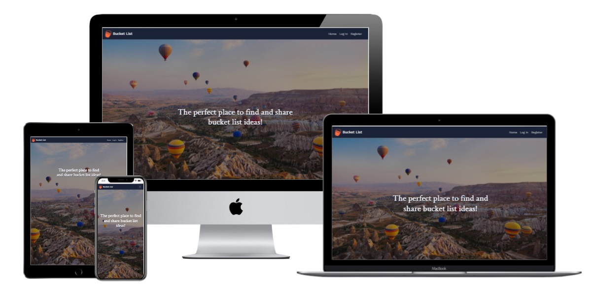
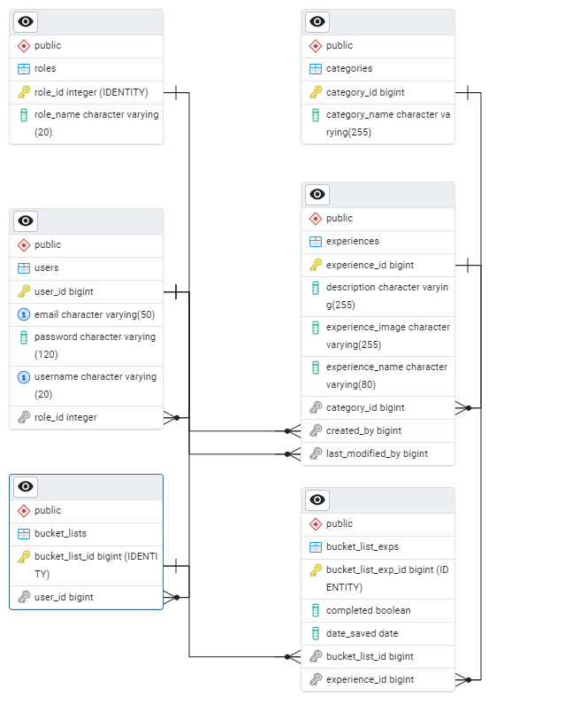

# Bucket List

* You can view the live project [here.]()

## Table of Contents
* [Project Description](#project-description)
* [UX](#ux)
    * [Project Goals](#project-goals)
    * [User Stories](#user-stories)
* [Features](#features)
    * [Database Schema](#database-schema)
    * [Colour Palette](#colour-palette)
    * [Fonts](#fonts)
    * [Base Template Features](#base-template-features)
    * [Home and Landing Page Features](#home-and-landing-page-features)
    * [Register Features](#register-features)
    * [Log In Features](#log-in-features)
    * [Profile Features](#profile-features)
    * [Experience Page Features](#experience-page-features)
    * [Experience Info Features](#experience-info-page-features)
    * [Create Experience Features](#create-experience-page-features)
    * [Edit Experience Page](#edit-experience-page-features)
    * [Future Features](#future-features)
* [Technologies Used](#technologies-used)
    * [Languages](#languages)
    * [Frameworks](#frameworks)
    * [Libraries](#libraries)
* [Bugs Encountered](#bugs-encountered)
* [Deployment](#deployment)


## Project Description
Bucket List is a community-led website that allows users to share, create and search for bucket list ideas to put on their own customised bucket list.

A Bucket List is a number of experiences or achievements that a person hopes to have or accomplish during their lifetime before they kick the bucket.

Users can register on the landing page and log in to the site in order to view these different ideas. They can then add these ideas to their Bucket List. Or, if they have already completed an experience, they can add it to their Done It list

The main Technologies used for the site are Java, Spring Boot, HTML, CSS, JavaScript, React and PostgreSQL


## UX:
### Project Goals
The primary goal of this project is to create a full-stack site that users can make use of. I want users to clearly understand how the site works and create a community of users that can create, save, and search for bucket list ideas through the site.

The secondary goal of this project is to strengthen my knowledge of Java, Spring Boot, React and PostgreSQL. I am hoping that the challenge of developing this site will allow me to understand these elements of full stack development more clearly.

### User Stories

The main target audience can be broken into two groups: regular users and other software developers/recruiters interested in how the website was made.

#### Regular User
As a regular user, I want:
1. A visually appealing site no matter what device I use.
2. The ability to easily navigate through the site the first time I visit.
3. The site’s purpose to be clear once I see the landing page so I can decide if I want to register or not
4. The ability to log in and out of the site once I am registered
5. The ability to search for bucket list ideas on the site by category.
6. The ability to view more information on a certain experience if I am interested in it.
7. The ability to create experiences that are not already on the site, so I can share them with the community.
8. The ability to edit an experience if I have made an error when creating it.
9. The ability to delete an experience I have created.
10. The ability to add an experience to my own customised bucket list that I can view on my profile.

#### Software Developer/Recruiter
As a software developer/recruiter, I want:
1. To view the developer’s Linked In profile
2. To view the developer’s GitHub repository for the project so I can look into their code
3. The ability to examine the creator’s ReadMe for more details on how the project was created.
4. View the site and play around with its features.


#### Developer Goals
My personal goals for this project are as follows:

As a developer, I want to:
1. Develop a deeper understanding of Java, Spring Boot, React, and PostgreSQL by creating an original project with CRUD functionality.
2. Create a professional looking project that I will be proud to put in my portfolio.

## Features
### Database Schema
The database schema was generated using Java model classes with JPA annotations in a Spring Boot application. Instead of writing SQL directly, I defined entities with relationships (e.g., @OneToOne, @ManyToOne) and used Spring Data JPA with Hibernate to map them to a PostgreSQL database.

The diagram below shows the resulting schema:



### Colour Palette
The three main colours I chose for the website are displayed in hex format below

* Orange #ff6a3d: Used for the website brand, the font awesome icons, and the buttons on the website
* Navy #1a2238: Used for the navbar, the footer, and the badges that display the experience categories on the experience cards.
* White #f8f8fb: Used for the font colour for buttons and nav-links on the site. I also used it for the social links in the footer.
* Black #101112: Used for the majority of the font colours on the site.

### Fonts
I used two different fonts for this website

* ['Crimson Text', serif:]( https://fonts.google.com/?query=crimson+text) Used for the website headings
* ['Work Sans', sans-serif:]( https://fonts.google.com/?query=work+sans) Used for all other font elements of the website.

### Base Template Features
* Navbar: The navbar displays the website logo and all the navbar links. The user can only see certain navbar links depending on if they are logged in/out. This was done through the use of React conditional rendering.
* Footer: The footer shows the GitHub and LinkedIn social links which will open a new tab for the user to view my LinkedIn profile and my GitHub repository for this project.

### Home and Landing Page Features
* Hero Image: The landing page has a hero image with a short heading within to keep the user on the site. This image covers the whole width of the page. 
* Latest Entries Section: This section displays the 4 most recent uploads made to the site by users. First time users can view more information on these experiences but need to sign up/log in to add these experiences to their bucket list.
* Experience cards: The Experience cards show an image, title, and category of an experience. The cards show the name of the user who added the experience to the site and there is a button at the end of the card to view more information on the experience. This will redirect the user to another page.

### Register Features
* Register Card: The Register card looks for the user to input a username, email, and password.
* Register Validation: If the user inputs a username/email that is already in the database, a message will appear notifying them that the username/email is already taken.
* Redirect to Log In page: There is a link within the Register card that redirects the user to the Log In page.
* Register Button: The user can click on the Register button once they have inputted their details. If the details are correct, they will be redirected to their new profile.

### Log In Features
* Log In Card: The Log In card looks for the user’s username and password they have used when signing up to the platform.
* Log In Validation: If the user inputs the wrong log in credentials, a message reading ‘Bad Credentials’ will display to notify the user of their mistake.
* Redirect to register page: There is a link within the log in card that redirects the user to the register page.
* Log In Button: The user can click on the log in button once they have inputted their details. If the details are correct, they will be redirected to the profile.
* Guest Log In Button: There is also the option to log in as a guest user if someone does not want to create a user to view the sight. This was implemented with recruiters and other developers in mind.

### Profile Features
* Bucket List Section: This section of the profile displays the user’s custom bucket list. The list will contain experiences they have saved to their profile and is styled to display the experience as cards. The user can then choose to remove these experiences from their bucket list if they want.
* No Items in Bucket List Section: The user will see a link in the Bucket List section if they have not yet saved any items to their bucket list. The link will redirect them to the experiences page where they can browse all experiences on the site.
* Experiences Created Section: This section of the profile displays a list of all the experiences created by the user. The experiences are shown in card format.
* No Items in Experiences Created Section: The user will see a link in the Experiences Created section if they have not yet created any experiences on the. The link will redirect them to the Create Experience page.

### Experience Page Features
* The experience page is broken into two sections. The first section is the search and sort container, and the second section is the experience/results container
* Sort filter: The search container also features a Sort filter that allows the user to sort all experiences by Category, or by Date Uploaded.
* Pagination: The Sort filter returns a lot more results than a specific search query. Therefore, pagination was inputted for the filter results. The pagination only displays eight cards per page and there are links at the bottom of the experiences container to go to the next page of experiences.

### Experience Info Page Features
* The experience info shows the usual card features but also shows the experience description.
* The user can also edit/delete the experience from the Experience Info page if they are the one who created the experience. Other users will not be able to view these settings as a result of React conditional statements inputted into the html page.
* Delete Experience Button: The delete experience button opens a modal that asks the user if they are sure they want to delete the experience from the site.
* Edit Experience Button: The edit experience button redirects the user to the Edit Experience Page

### Create Experience Page Features
* The create experience page features a form for the user to input the necessary details that give information about the experience they want to upload.
* Experience Title Requirements: The title of the experience must be between 5 and 30 characters and the form will not post if nothing is inputted into this field.
* Category Dropdown: The Category dropdown only allows the user to choose from a limited list of categories for their experience. Only the admin can create a new experience category. The form will not post if nothing is inputted into this field.
* Image Address: The image address will render the image for the experience on the card. The form will not post if nothing is inputted into this field.
* Description: The user must give the community more information about this experience by inputting more details into this field.

### Edit Experience Page Features
* The edit experience page is very similar to the create experience page. It features a form for the user to input the necessary details that give information about the experience they want to edit.
* The previous experience details will be inputted by default into each of the input fields. The user can then edit the information that is displayed to them in the inputs.

### Future Features
* Contact Page: The user could send a message to the developer via an email that is sent through the Contact Page
* Email Validation: API integration to send an email to the user once they create an account to validate that it's a real person.
* Community: View your friends' bucket lists. 

## Technologies Used
### Languages
* HTML
* CSS
* JavaScript
* Java
* Spring Boot 
* PostgreSQL
* React

### Libraries
* [Google fonts:](https://fonts.google.com/) Used to find appropriate fonts for the website
* [Font Awesome:](https://fontawesome.com/icons?d=gallery&p=2) Provided the icons for the website buttons and the social media links in the footer.

## Bugs Encountered
* **Java: TransientObjectException when deleting an experience**

Problem: While trying to delete an experience, the application threw the following error:

```
org.hibernate.TransientObjectException: persistent instance references an unsaved transient instance of 'com.bucketlist.project.model.Experience'

```

Cause: Some Bucket List Experience entries were still referencing the experience being deleted. Hibernate tried to automatically handle these related objects because of the cascade settings and eager fetch type. But since the references weren’t handled properly, Hibernate didn’t know how to complete the operation and threw a TransientObjectException.

Solution: I resolved the issue in two steps:

1. I explicitly removed all BucketListExp entries related to the experience using a custom delete query before deleting the experience itself.

2. I updated the fetch strategy on the @OneToMany relationship to FetchType.LAZY so related data would only load when needed, avoiding unnecessary conflicts.
```
@OneToMany(mappedBy = "experience", cascade = {CascadeType.PERSIST, CascadeType.MERGE}, fetch = FetchType.LAZY)
private List<BucketListExp> bucketListExps = new ArrayList<>();
```


* **React: Edit Form Fields Empty On Page Load**

Problem: When opening the edit experience page, the form would render, but all the input fields were empty — even though the experience had data in the backend.

Cause: The form was being rendered before the singleExperience data had finished loading from the backend. As a result, the controlled inputs tried to use undefined values, which led to blank fields.

Solution: I fixed this by:

1. Using useEffect to wait until singleExperience was available, then setting the form state (formData)

2. Adding a conditional check: the form only renders after singleExperience has loaded
```
if (isLoading || !singleExperience) return <p className="text-center mt-6">Loading...</p>;
```


## Deployment


